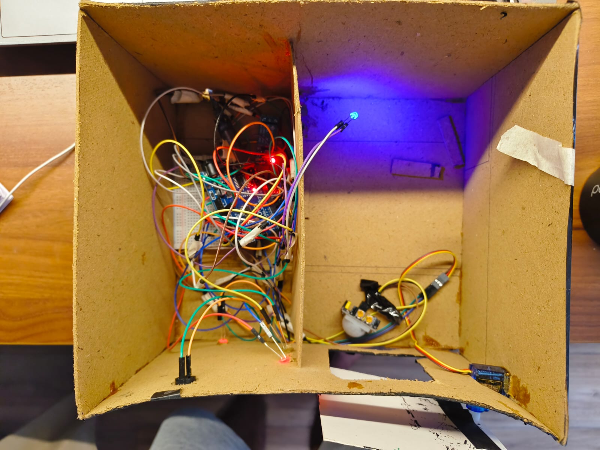
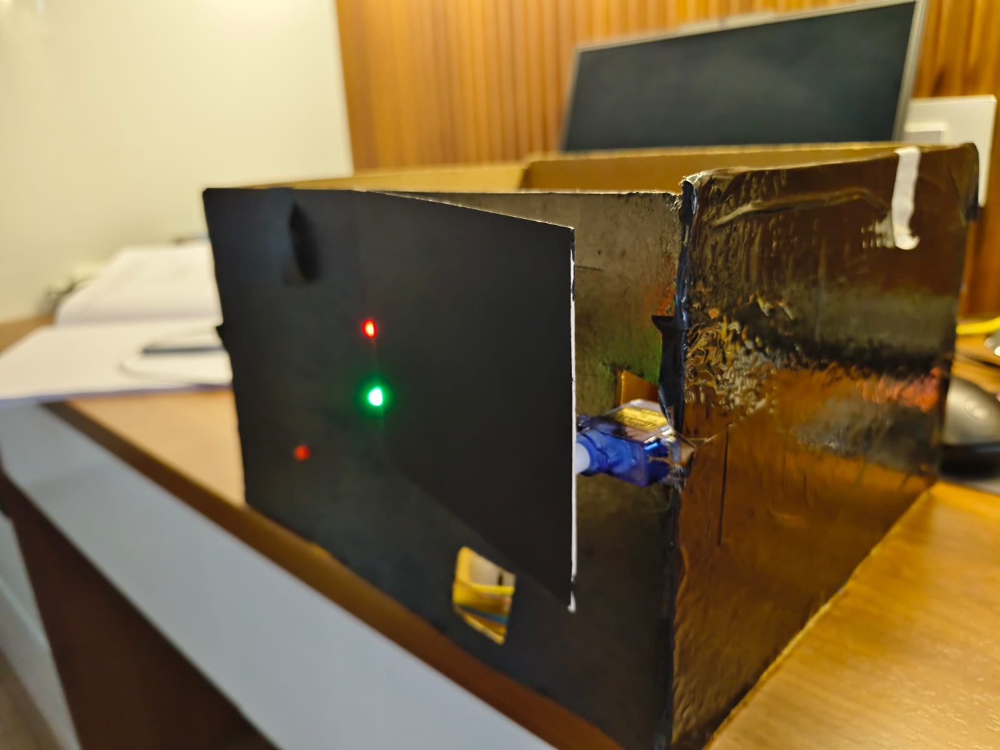
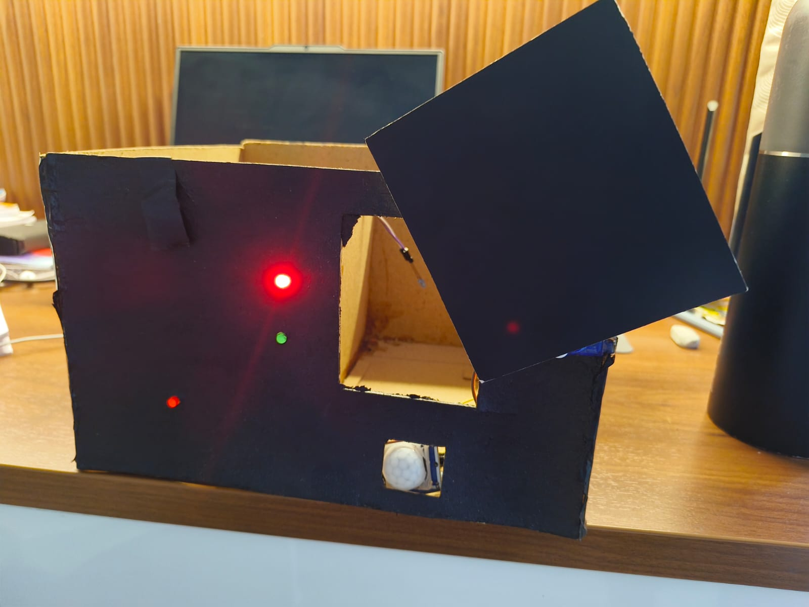

---

# 🏛️ System Hardware Architecture

The implemented prototype follows a **multi-layer hardware safety architecture** where UV-C sterilization is enabled only after all predefined safety conditions are satisfied. The Arduino UNO continuously processes sensor inputs, controls the relay and servo motor, monitors chamber safety, and immediately shuts down UV operation whenever an unsafe condition is detected.

<i><b>Implemented Hardware Architecture</b> – Interaction between the Arduino UNO, PIR sensor, magnetic reed switch, servo motor, relay module, UV-C lamp, buzzer, and LED indicators.</i>

---

# 🌐 Proposed Scalable Architecture

Beyond the prototype, the project proposes a **next-generation UV-C room sterilization framework** designed for large enclosed environments. The architecture introduces a **rotating UV-C belt mechanism**, centralized UV coverage, distributed lamp placement, and integrated multi-layer safety controls to achieve uniform disinfection while minimizing shadow zones.

<i><b>Proposed Scalable Architecture</b> – Conceptual room-scale UV-C disinfection system featuring a rotating belt mechanism, central UV coverage, distributed lamp positioning, and integrated safety framework.</i>

---

# 🔄 System Workflow

The operational workflow illustrates the complete sterilization cycle, beginning with object placement and ending with safe cycle completion. Every stage continuously validates safety conditions before UV activation, ensuring complete user protection through automatic monitoring and emergency shutdown mechanisms.

<i><b>Smart UV Sterilization Workflow</b> – Complete operational sequence from object placement to safe cycle completion.</i>

---

🛠️ Hardware Components

| Component | Quantity | Purpose |
|-----------|:--------:|---------|
| Arduino UNO | 1 | Main Control Unit |
| PIR Motion Sensor | 1 | Human Presence Detection |
| Magnetic Reed Switch | 1 | Door Interlock Verification |
| Servo Motor | 1 | Automatic Door Lock |
| Relay Module | 1 | Controls UV-C Lamp |
| UV-C Lamp / UV LED | 1 | Sterilization Unit |
| Buzzer | 1 | Audible Warning Alert |
| LED Indicators | 2 | System Status Display |
| Power Supply | 1 | Powers the Complete System |

---

# 🔐 Multi-Layer Safety Framework

The Smart UV Sterilization Safety System employs **seven independent safety layers**, ensuring that UV-C radiation is emitted only when all safety conditions are satisfied.

| Safety Layer | Function |
|--------------|----------|
| Layer 1 | Object Placement |
| Layer 2 | Door Interlock Verification |
| Layer 3 | Human Presence Detection |
| Layer 4 | Pre-Activation Warning Alert |
| Layer 5 | Automatic Door Locking |
| Layer 6 | Controlled UV-C Activation |
| Layer 7 | Continuous Monitoring & Automatic Emergency Shutdown |

---

# 📸 Prototype Gallery

| Prototype | Wiring | Chamber |
|:---------:|:------:|:-------:|
|  |  |  |

<i>Physical prototype, wiring connections, and enclosed sterilization chamber.</i>

---

# 📄 Documentation

Complete project documentation is available inside the **Documentation** folder.

- 📑 Project Report
- 📖 Research Paper
- 📊 Project Presentation (PPT)

---

# 🚀 Future Improvements

### 🤖 Smart Features

- AI-Based Human Detection
- IoT Monitoring Dashboard
- Mobile Application Support

### 🛡️ Safety Enhancements

- UV Dose Monitoring Sensor
- Adaptive Sterilization Profiles
- Predictive Maintenance

### ☁️ Industry 4.0 Integration

- Cloud Logging
- Remote Monitoring
- Digital Twin Integration
- Data Analytics Dashboard

---

# 👨‍💻 Team

**Project:** Smart UV Sterilization Safety System

Developed as part of the **Biosafety Engineering Project**

---

## ⭐ If you found this project interesting, consider giving it a Star!

**Made with ❤️ for the Biosafety Engineering Project**

*RV College of Engineering (RVCE), Bengaluru*

