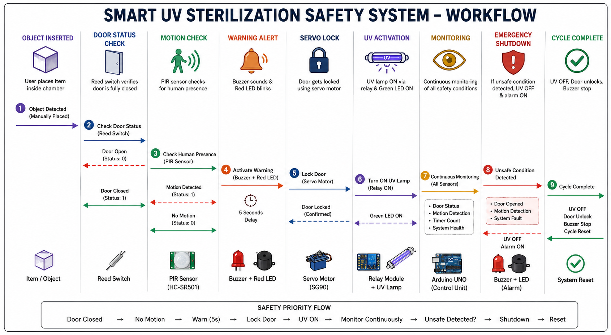

# 🛡️ Smart UV Sterilization Safety System

> **Safety-First UV-C Sterilization Chamber with Multi-Layer Protection Framework**

The **Smart UV Sterilization Safety System** is a microcontroller-based enclosed UV-C sterilization chamber designed to safely disinfect objects while preventing accidental human exposure. The system integrates multiple hardware safety layers including **human detection**, **door interlock verification**, **automatic door locking**, **warning alerts**, **real-time monitoring**, and **emergency shutdown** mechanisms.

<div align="center">


<i><b>Prototype Demonstration</b> – Physical implementation of the Smart UV Sterilization Safety System.</i>

</div>

---


---

# ✨ System Highlights

- 🔒 Multi-Layer Safety Framework
- 🚪 Magnetic Door Interlock Verification
- 👤 PIR-Based Human Detection
- 🔔 Pre-Activation Warning Alert
- 🤖 Automatic Servo Door Lock
- ☢️ Relay Controlled UV-C Lamp
- 📡 Continuous Safety Monitoring
- 🛑 Emergency Shutdown Mechanism
- ⏱️ Timer-Based Sterilization Cycle
- 💡 Visual Status Indication using LEDs

---

# 🏛️ System Architecture

The system follows a **layered safety architecture** where UV sterilization is permitted only after all safety conditions are satisfied.

<div align="center">


<i>Hardware Architecture and System Mapping</i>

</div>

---

# 🔄 Working Principle

The complete sterilization process follows a safety-first workflow.

<div align="center">



<i>Smart UV Sterilization Operational Workflow</i>

</div>

---

# ⚙️ Working Sequence

```text
Object Placed

        │

        ▼

Door Closed

        │

        ▼

Door Verification (Reed Switch)

        │

        ▼

Human Detection (PIR)

        │

        ▼

Warning Alert (Buzzer + LED)

        │

        ▼

Servo Locks Door

        │

        ▼

Relay Activates UV Lamp

        │

        ▼

Continuous Monitoring

        │

        ▼

Unsafe Condition?

      ┌───────┐
      │ YES   │
      ▼       │
Emergency     │
Shutdown      │
      │       │
      └───────┘

        │ NO

        ▼

Sterilization Complete

        │

        ▼

UV OFF

Door Unlock

Cycle Reset
```

---

# 🛠️ Hardware Components

| Component | Purpose |
|------------|---------|
| Arduino UNO | Main Controller |
| PIR Sensor | Human Detection |
| Reed Switch | Door Status Detection |
| Servo Motor | Automatic Door Lock |
| Relay Module | Controls UV Lamp |
| UV-C Lamp | Sterilization |
| Buzzer | Warning Alert |
| LEDs | Status Indication |
| Power Supply | System Power |

---

# 🔐 Multi-Layer Safety Framework

The project is built around **seven independent safety layers**.

| Layer | Function |
|--------|----------|
| Layer 1 | Object Placement |
| Layer 2 | Door Verification |
| Layer 3 | Human Detection |
| Layer 4 | Warning Alert |
| Layer 5 | Automatic Door Lock |
| Layer 6 | UV Sterilization |
| Layer 7 | Continuous Monitoring & Emergency Shutdown |

---

# 📂 Repository Structure

```text
BIOSAFETY_EL
│
├── Documentation
│   ├── BIOSAFETY PAPER.pdf
│   ├── BIOSAFETY REPORT.pdf
│   └── BIOSAFETY PPT.pdf
│
├── images
│   ├── image1.jpeg
│   ├── image2.jpeg
│   ├── image3.jpeg
│   ├── architecture.png
│   └── workflow.png
│
├── Software
│   ├── Final Code
│   └── Test Codes
│
└── README.md
```

---

# 📸 Prototype Gallery

<div align="center">

| Prototype | Wiring | Chamber |
|-----------|--------|----------|
|  |  |  |

</div>

---

# 📄 Documentation

The following project documents are available inside the **Documentation** folder.

- 📑 Project Report
- 📖 Research Paper
- 📊 Project Presentation

---

# 🚀 Future Improvements

- 🤖 AI Vision Based Human Detection
- ☁️ IoT Monitoring Dashboard
- 📱 Mobile Application
- 🌐 Cloud Logging
- 📊 UV Dose Monitoring
- 📈 Predictive Maintenance
- 📡 Remote Monitoring
- 🧠 Intelligent Sterilization Profiles

---

# 👨‍💻 Team

**Project:** Smart UV Sterilization Safety System

Developed as part of the **Biosafety Engineering Project**

---

<div align="center">

## ⭐ If you found this repository useful, consider giving it a star!

Made with ❤️ for Biosafety Engineering Project

</div>