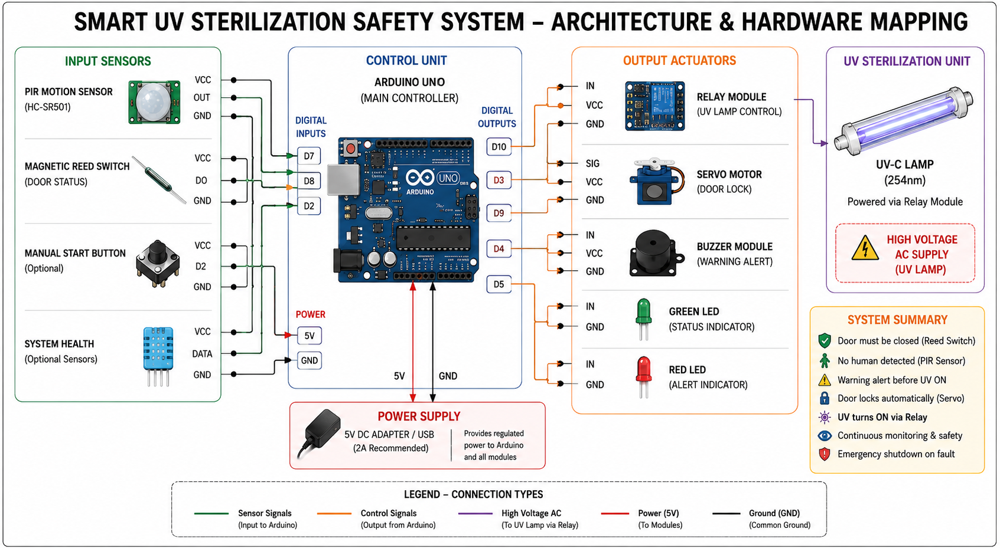
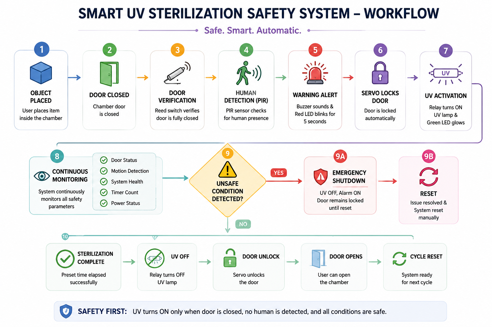

---

# 🏛️ System Hardware Architecture

The implemented prototype follows a **multi-layer hardware safety architecture** where UV-C sterilization is enabled only after all predefined safety conditions are satisfied. The Arduino UNO continuously processes sensor inputs, controls the relay and servo motor, monitors chamber safety, and immediately shuts down UV operation whenever an unsafe condition is detected.

<i><b>Implemented Hardware Architecture</b> – Interaction between the Arduino UNO, PIR sensor, magnetic reed switch, servo motor, relay module, UV-C lamp, buzzer, and LED indicators.</i>

---

# 🌐 Proposed Scalable Architecture

Beyond the prototype, the project proposes a **next-generation UV-C room sterilization framework** designed for large enclosed environments. The architecture introduces a **rotating UV-C belt mechanism**, centralized UV coverage, distributed lamp placement, and integrated multi-layer safety controls to achieve uniform disinfection while minimizing shadow zones.

<i><b>Proposed Scalable Architecture</b> – Conceptual room-scale UV-C disinfection system featuring a rotating belt mechanism, central UV coverage, distributed lamp positioning, and integrated safety framework.</i>

---

# 🔄 System Workflow

The operational workflow illustrates the complete sterilization cycle, beginning with object placement and ending with safe cycle completion. Every stage continuously validates safety conditions before UV activation, ensuring complete user protection through automatic monitoring and emergency shutdown mechanisms.

<i><b>Smart UV Sterilization Workflow</b> – Complete operational sequence from object placement to safe cycle completion.</i>

---
